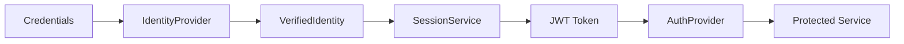

# CLAUDE.md

This file provides guidance to Claude Code (claude.ai/code) when working with the Rust Agent Stack.

## Quick Reference

### Development Commands
```bash
# Core commands
cargo build                    # Build entire workspace
cargo test                     # Run all tests
cargo fmt && cargo clippy      # Format and lint

# Run examples
cargo run -p basic-jsonrpc     # JSON-RPC service
cargo run -p oauth2-demo       # OAuth2 example
cargo run -p rest-api-demo     # REST API example
cargo run -p file-service-example  # File upload/download

# Build WASM examples
cd examples/wasm-ui-demo && ./build.sh  # Dominator UI
cd examples/rest-wasm-example && npm run build  # REST TypeScript client
```

## Architecture Overview

Rust Agent Stack (RAS) is a comprehensive framework for building type-safe, authenticated distributed systems with JSON-RPC, REST APIs, and file services.

### 🏗️ Project Structure
```
crates/
├── core/              # Shared traits and types
│   ├── ras-auth-core
│   ├── ras-identity-core
│   └── ras-observability-core
├── rpc/               # JSON-RPC implementation
│   ├── ras-jsonrpc-types
│   ├── ras-jsonrpc-core
│   ├── ras-jsonrpc-macro
│   └── bidirectional/
├── rest/              # REST API implementation
│   ├── ras-rest-core
│   ├── ras-rest-macro
│   └── ras-file-macro # NEW: File upload/download
├── identity/          # Auth providers
│   ├── ras-identity-local
│   ├── ras-identity-oauth2
│   └── ras-identity-session
├── observability/
│   └── ras-observability-otel
├── specs/
│   └── openrpc-types
└── tools/
    └── openrpc-to-bruno
```

### 🎯 Key Features

1. **Type-Safe Service Macros**
   - `jsonrpc_service!` - JSON-RPC services with OpenRPC docs
   - `rest_service!` - REST APIs with OpenAPI 3.0 docs
   - `file_service!` - File upload/download with streaming
   - `jsonrpc_bidirectional_service!` - WebSocket bidirectional RPC

2. **TypeScript Client Generation**
   - All macros support WASM compilation to TypeScript
   - Type-safe API calls with full IntelliSense
   - Automatic bearer token management
   - Works in browsers and Node.js

3. **Flexible Authentication**
   - Pluggable `IdentityProvider` trait
   - Built-in providers: Local (Argon2), OAuth2, JWT
   - Permission-based access control
   - Security best practices (timing attack resistance, etc.)

4. **Production-Ready Features**
   - OpenTelemetry metrics with Prometheus export
   - API documentation generation (OpenRPC/OpenAPI)
   - Structured error handling
   - Request rate limiting

## 💻 Development Guidelines

### Workspace Management
```toml
# Root Cargo.toml - Add shared deps here
[workspace.dependencies]
axum = "0.7"
serde = { version = "1.0", features = ["derive"] }

# Crate Cargo.toml - Reference workspace deps
[dependencies]
axum = { workspace = true }
ras-auth-core = { path = "../core/ras-auth-core" }
```

### Critical Rules
1. **Test Immediately**: Run `cargo build` after every change
2. **Use Workspace Deps**: Never duplicate dependency versions
3. **Minimal Dependencies**: Core crates should have minimal deps
4. **Macro-Only Crates**: Procedural macros can ONLY export macros

### ⚠️ Common Pitfalls

| Issue | Wrong ❌ | Correct ✅ |
|-------|---------|------------|
| Router Nesting | `.merge(router.nest("/api", ...))` | `.nest("/api", router)` |
| Bidirectional Macro | `openrpc: true` in bidirectional | Remove `openrpc` field |
| Generated Names | Expect `ChatService` trait | Actually `ChatServiceService` |
| String Types | Mix `String` and `&str` in builders | Check bon builder types |
| Module Exports | Private module items | Add `pub` to exports |

## 📚 Service Macro Examples

### JSON-RPC Service
```rust
jsonrpc_service!({
    service_name: TaskService,
    openrpc: true,  // Generates OpenRPC docs
    methods: [
        UNAUTHORIZED sign_in(SignInRequest) -> SignInResponse,
        WITH_PERMISSIONS(["user"]) create_task(CreateTaskRequest) -> Task,
        WITH_PERMISSIONS(["admin"]) delete_all_tasks(()) -> (),
    ]
});
```

### REST API Service
```rust
rest_service!({
    service_name: UserService,
    base_path: "/api/v1",
    openapi: true,
    serve_docs: true,  // Swagger UI at /api/v1/docs
    endpoints: [
        GET UNAUTHORIZED users() -> UsersResponse,
        POST WITH_PERMISSIONS(["admin"]) users(CreateUserRequest) -> User,
        GET WITH_PERMISSIONS(["user"]) users/{id: String}() -> User,
        DELETE WITH_PERMISSIONS(["admin"]) users/{id: String}() -> (),
    ]
});
```

### File Service
```rust
file_service!({
    service_name: DocumentService,
    base_path: "/api/documents",
    body_limit: 52428800,  // 50MB
    endpoints: [
        UPLOAD WITH_PERMISSIONS(["user"]) upload() -> FileMetadata,
        DOWNLOAD UNAUTHORIZED download/{file_id: String}(),
    ]
});
```

### Bidirectional WebSocket
```rust
jsonrpc_bidirectional_service!({
    service_name: ChatService,
    // NO openrpc field here!
    client_to_server: [
        WITH_PERMISSIONS(["user"]) send_message(SendMessageRequest) -> SendMessageResponse,
    ],
    server_to_client: [
        message_received(MessageReceivedNotification),
    ]
});
```

## 🧪 Testing & Security

### Security Checklist
- [ ] Timing attack resistance (constant-time auth)
- [ ] Username enumeration prevention
- [ ] Rate limiting (5 concurrent auth attempts)
- [ ] Argon2 password hashing
- [ ] JWT expiration and revocation
- [ ] PKCE for OAuth2 flows

### Testing Strategy
1. **Unit Tests**: Test individual components
2. **Integration Tests**: Test crate interactions
3. **E2E Tests**: Test complete auth flows
4. **Macro Tests**: Test generated code with real routes

## 🔐 Authentication Architecture

### Two-Stage Flow


### Identity Providers
- **Local**: Username/password with Argon2
- **OAuth2**: Google/GitHub with PKCE
- **Session**: JWT management with revocation

### Permission Models
```rust
// Single permission (OR logic)
WITH_PERMISSIONS(["admin", "moderator"])

// Multiple required (AND logic)
WITH_PERMISSIONS([["verified", "premium"]])

// Complex combinations
WITH_PERMISSIONS([["admin"], ["user", "verified"]])
// Requires: admin OR (user AND verified)
```

## 📦 TypeScript/WASM Client Generation

### Setup
```toml
# Cargo.toml
[lib]
crate-type = ["cdylib", "rlib"]

[features]
wasm-client = ["wasm-bindgen"]

[target.'cfg(target_arch = "wasm32")'.dependencies]
wasm-bindgen = "0.2"
```

### Build Process
```bash
# Install wasm-pack
cargo install wasm-pack

# Build TypeScript bindings
wasm-pack build --target web --features wasm-client
```

### Usage in TypeScript
```typescript
import init, { WasmUserServiceClient } from './pkg/my_api';

// Initialize WASM
await init();

// Create client
const client = new WasmUserServiceClient('http://localhost:3000');
client.set_bearer_token('jwt-token');

// Make type-safe API calls
const users = await client.get_users();
const user = await client.create_user({ name: 'Alice' });
```

## 🚀 Production Deployment

### Security Checklist
- [ ] Set strong JWT secrets (min 32 chars)
- [ ] Configure CORS for specific origins
- [ ] Enable HTTPS everywhere
- [ ] Set up rate limiting
- [ ] Use environment variables for secrets
- [ ] Enable structured logging
- [ ] Configure database (not JSON files)

### Monitoring Setup
```rust
// Enable OpenTelemetry
let otel = standard_setup("my-service")?;

// Add to service builders
.with_usage_tracker(otel.usage_tracker())
.with_method_duration_tracker(otel.duration_tracker())

// Metrics available at /metrics
```

### WASM Deployment
- Build with `--release` flag
- Use CDN for static assets
- Configure WebSocket proxy
- Enable gzip/brotli compression

## 📖 Additional Resources

- **Detailed Docs**: See `documentation/` directory
- **Examples**: See `examples/` for working code
- **MCP Integration**: Use Context7 for dependency docs
- **Dominator Help**: Ask about reactive UI patterns